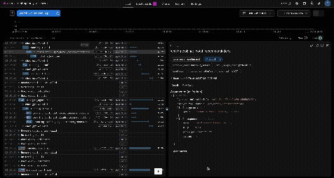

# 🚀 AI Travel Assistant Setup Guide


## 📋 Prerequisites

Before you begin, ensure you have:

- 🐍 **Python 3.10+**
- 🔑 **OpenAI API Key** 
- 💻 **Terminal/Command Line**

---

## ⚡ Quick Start

### 1️⃣ Environment Setup

Create and activate virtual environment:
```bash
python3 -m venv .venv
source .venv/bin/activate  # On Windows: .venv\Scripts\activate
```

### 2️⃣ Install Dependencies

Install Poetry (if not already installed):
```bash
pip install poetry
```

Install project dependencies:
```bash
poetry install
```

### 3️⃣ Configure Environment

Copy the environment template:
```bash
cp .env.example .env
```

**🔧 Edit `.env` file:**
- Set your `OPENAI_API_KEY=your_actual_api_key_here`
- Leave other variables as default

### 4️⃣ Optional: Logfire Integration



For advanced logging and monitoring:

1. Enable logfire in `.env`:
   ```bash
   LOGFIRE_ENABLED=true
   ```

2. Authenticate with Logfire:
   ```bash
   logfire auth
   ```

3. Connect to your project:
   ```bash
   logfire projects use your-project-name-from-portal
   ```

### 5️⃣ Initialize Data

Create vector collections from seed data:
```bash
make ingest
```

> ⏳ **Note:** This process may take a few minutes. You'll see`---Starting data ingestion---` at the beginning and  `---Data ingestion completed!---` when finished.

### 6️⃣ Launch Application

Choose your preferred way to run:

```bash
# 🌐 API only (FastAPI)
make dev

# 🎨 UI only (Streamlit)  
make ui

# 🚀 Both API + UI (Recommended)
make both
```


---

## 🎯 Access Your Application

| Service | URL | Description |
|---------|-----|-------------|
| 🌐 **API** | http://localhost:8000 | FastAPI backend |
| 🎨 **UI** | http://localhost:8501 | Streamlit interface |
| 📚 **Docs** | http://localhost:8000/docs | Interactive API documentation |

---

Running unit test suite:
```bash
make test
```

---

## 🛠️ Available Commands

| Command | Description |
|---------|-------------|
| `make dev` | Start FastAPI development server |
| `make ui` | Start Streamlit UI |
| `make both` | Start both services |
| `make ingest` | Load seed data into vector stores |
| `make test` | Run test suite |
| `make clean` | Clean up cache files |

---

## 🎉 You're All Set!

Your AI Travel Assistant is ready to help plan amazing trips! 

**Happy coding!** ✈️🏖️🏔️

---

<div align="center">
  <sub>Built with ❤️ using FastAPI, OpenAI, and Streamlit</sub>
</div>