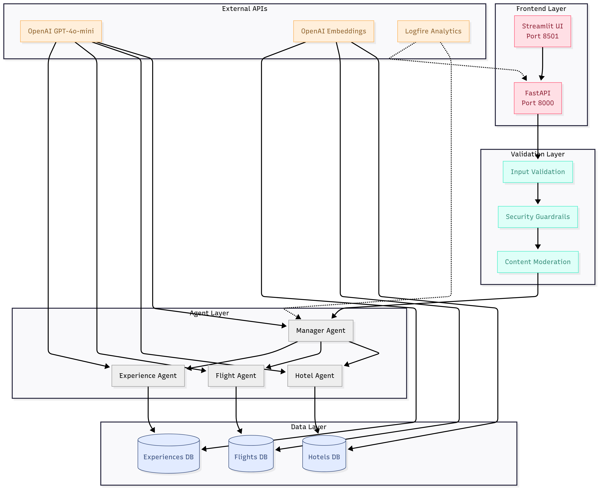
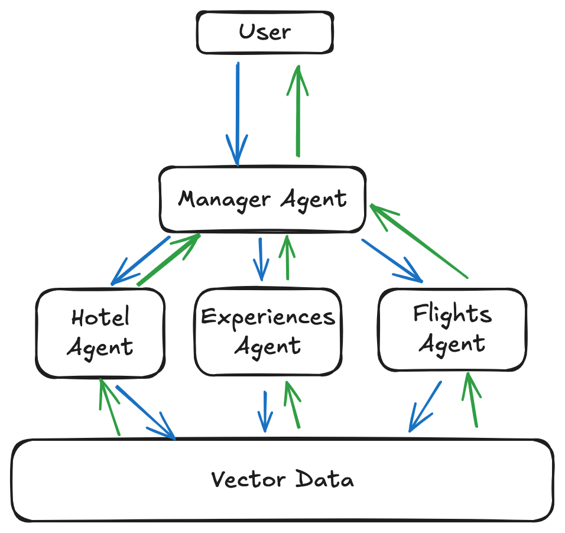

# AI Travel Assistant - Technical Summary

Multi Agent [RAG](https://blogs.nvidia.com/blog/what-is-retrieval-augmented-generation/) system for travel recommendations using Virgin Atlantic seed data

---

## 🏗️ Architecture Overview

### System Design

**Core Components:**
- **Manager Agent**: Orchestrates specialist agents and coordinates responses
- **Specialist Agents**: Domain specific agents for hotels, flights, and experiences
- **RAG Pipeline**: ChromaDB vector store with semantic search capabilities
- **Validation Layer**: Multi tier guardrails and response validation

### Data Flow

**Request Processing:**
1. User query → Input validation → Manager agent
2. Manager agent → Distributes to specialist agents
3. Specialist agents → Query vector store → Return structured data
4. Manager agent → Consolidates responses → Validates against seed data
5. Validated response → User

---

## 🛠️ Technology Stack

| Component | Technology | Purpose |
|-----------|------------|---------|
| **AI Framework** | [PydanticAI](https://ai.pydantic.dev/) | Multi agent orchestration |
| **Data Processing** | [LangChain](https://www.langchain.com/) | Document ingestion & chunking |
| **Vector Database** | [ChromaDB](https://pypi.org/project/chromadb/) | Semantic search & retrieval |
| **API Framework** | [FastAPI](https://github.com/fastapi) | REST API endpoints |
| **LLM Provider** | [OpenAI](https://platform.openai.com/) | GPT-4o-mini for inference |
| **Validation** | [Pydantic](https://docs.pydantic.dev/latest/) | Type safety & data validation |
| **Observability** | [Logfire](https://pydantic.dev/logfire) | Monitoring & debugging |
| **Package Management** | [Poetry](https://python-poetry.org/) | Dependency management |

---

## 🏛️ Architectural Decisions

### Multi Agent Design
**Why:** Domain specialisation, clear separation of concerns, reusable components
- **Hotel Agent**: Accommodation recommendations with filtering
- **Flight Agent**: Route optimisation and availability
- **Experience Agent**: Activity and attraction suggestions

### Vector Database Strategy
**Why:** Semantic search over exact matching for better relevance
- **Chunking**: 100 document batches for optimal performance
- **Metadata Extraction**: Rich context for LLM reasoning
- **Similarity Scoring**: Ranked results for quality filtering

### Response Validation
**Why:** Prevent hallucination and ensure seed data accuracy
- **Seed Data Verification**: All recommendations validated against source data
- **Structured Output**: Pydantic models enforce response schema

---

## 🛡️ Security & Validation

### Input Guardrails
- ✅ **Length Validation**: 3-1000 character limits
- ✅ **Injection Protection**: SQL injection, XSS, script detection
- ✅ **Content Moderation**: OpenAI moderation API integration
- ✅ **Travel Relevance**: Domain specific query filtering
- ✅ **Gambling Prevention**: Blocked gambling related queries

### Output Validation
- ✅ **Hallucination Prevention**: Responses validated against seed data
- ✅ **Schema Enforcement**: Pydantic type validation
- ✅ **Completeness Checks**: All required fields populated

### Configuration Security
- 🔐 **Environment Variables**: API keys in `.env` files
- 🔐 **No Hardcoded Secrets**: All sensitive data externalised

---

## 🧪 Quality Assurance

### Testing Strategy
- **Unit Tests**: Individual component validation
- **Integration Tests**: End-to-end API testing 
- **Agent Tests**: Multi agent workflow validation
- **Validator Tests**: Security and input validation

### Code Quality
- **Linting**: Pylint with industry standards
- **Type Safety**: Full Pydantic type coverage
- **Documentation**: Comprehensive inline documentation
- **Modularity**: Clean separation of concerns

---

## 📊 Data Handling

### Seed Data Processing
- **Price Field Issue**: Invalid `[object Object]` values replaced with realistic random pricing, assuming the JSON format issue in see data
- **Metadata Extraction**: Rich metadata for enhanced LLM context
- **Chunked Ingestion**: Optimised batch processing for performance

### Vector Store Optimization
- **Embedding Model**: `text-embedding-3-large` for high-quality vectors
- **Search Parameters**: Configurable similarity thresholds
- **Persistence**: Local ChromaDB storage with backup capabilities

---

## 🖥️ User Interface

### Streamlit Chatbot

As an additional feature a chat UI is created with streamlit. 

**Access**: `http://localhost:8501`

**Features:**
- Interactive chat interface
- Structured response formatting
- Real time API integration
- Error handling and user feedback

---

## 🚀 Future Enhancements

### Security Improvements
- OAuth 2.0 / JWT authentication
- API key vault integration (AWS Secrets Manager, HashiCorp Vault)
- PII detection and masking
- Rate limiting and abuse prevention

### Performance Optimisations
- Response caching layer
- Async vector search
- Load balancing for high availability
- Enchance agent prompts overtime with better optimisation

### Enhanced Validation
- AI powered response validation agent
- Real time data freshness checks
- Multi model consensus validation
- User feedback integration for measuring effectiveness of responses overtime with better statistical evidence

### Observability & Analytics
- Cost optimisation dashboards
- Performance bottleneck analysis
- User satisfaction metrics
- A/B testing framework

### Infrastructure
- **Containerisation**: Docker deployment ready
- **Microservices**: Separate services for ingestion, agents, and validation
- **CI/CD Pipeline**: Automated testing and deployment
- **Integration Testing**: [TestContainers](https://testcontainers.com/) for OpenAI mocking

### User Experience
- Feedback collection system
- Personalisation based on preferences
- Multi language support
- Voice and Video interface integration
